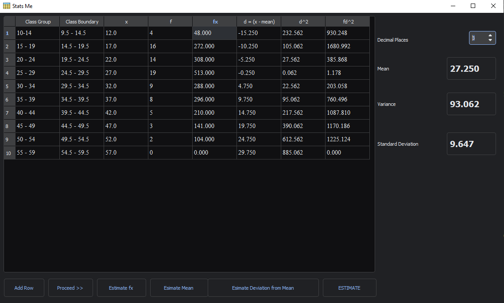

# Stats Me - Statistical Calculator

Stats Me is a Python-based statistical calculator with a graphical user interface built using PyQt5. This tool allows you to estimate class boundaries, create frequency distributions, calculate mean, variance, and standard deviation, all within an intuitive and easy-to-use application.

## Features

- Estimate class boundaries for statistical data.
- Generate frequency distributions for your data sets.
- Calculate the mean, variance, and standard deviation of your data.
- Supports a dark theme for a comfortable user experience.

## Installation

To run StatMaster on your local machine, follow these steps:

1. First, ensure you have Python installed on your computer. If Python is not already installed, you can download it from https://www.python.org/downloads/

2. Clone this repository to your computer:

   ```bash
   git clone https://github.com/xtechnologies/stats-me.git

3. Change your current working directory to the location of the project

    ```bash
    cd Stats-Me

4. Install the required dependencies using pip:

    ```bash
    pip install -r requirements.txt

5.  Run the application:

    ```bash
    python main.py


## Usage

-   Launch the application and interact with the user-friendly GUI to perform your statistical calculations.
-   Enter your data, configure settings, and view the results in real-time.
-   Use the dark theme for a more comfortable and stylish experience.\
## Contributing
I welcome contributions! If you'd like to improve this project, open a pull request

## Screenshot


## License
This project is licensed under the MIT License - see the [LICENSE](LICENSE.txt) file for details.

## Acknowledgments
-    Logo used in the app: [Table icons created by Freepik - Flaticon](https://www.flaticon.com/free-icons/table)
-   The development of this application was made possible thanks to the PyQt5 and QDarkTheme libraries.